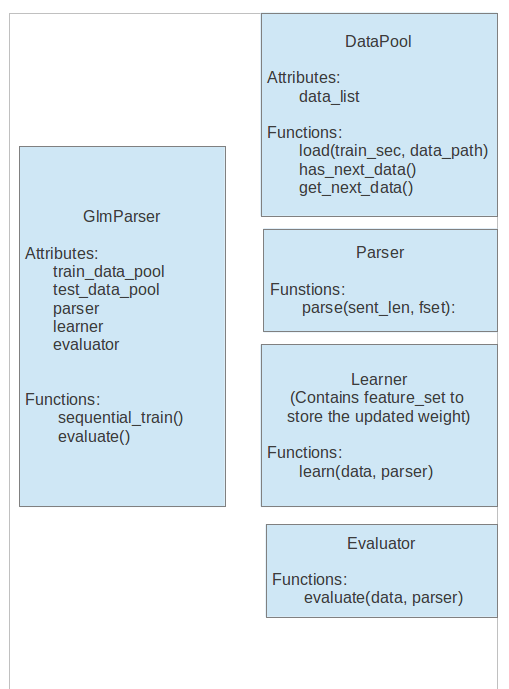

# GLM Parser Documentation

## Running the parser

The up to date information for how to train the parser and run it
on test data should always be in the [README file](../README.md).

## Code Structure

The code for this project is organized into the following main directories:

* `config`: contains the config files for different data formats
* `src`: contains all the source code.
* `scripts`: all the scripts for running experiments including scripts to submit jobs to the RCG cluster.
* `logs`: keep all your experiment logs in here organized by date with the following information. The goal is to be able to checkout that version of the code and run the same experiment and get the same results recorded in the `glm_parser.log` file.
    * keep the git SHA1 key of the branch being used to run the experiment (use `git log`), 
    * the enviroment (use `env` to dump your shell environment variables) 
    * the command that was run to obtain the results (e.g. `python2.7 glm-parser.py [options]`)
* `docs`: all the documentation of the project.

The contents of `src` are organized as follows:

### `config`
This folder contains the configuration files for different file formats.
Currently, we have configuration files for Penn2Malt and CoNLL-X formats.
You can use alternative data formats by creating a config file.
Each line in the config file corresonds to a column in the data file.
If you wish the GLM parser to create a dependency tree for each sentence,
append at the end of the config file, in two new lines, the line numbers of the head and dependency relation field names in that order.

### `data`

This module contains the classes used to load test data from Penn
Treebank and creates the class DependencyTree which stores the
information of test data: wordlist, taglist (part-of-speech tags),
edges in the dependency tree.

- `DependencyTree`
: This data structure represents the output of a dependency parser.
  Each class instance stores four types of information: node set,
  part-of-speech (POS) set, edge set and edge type. This information
  is sufficient to construct a dependency tree. This class also
  provides interfaces to manipulate the information, including
  retrieving nodes, edges, types, modifying nodes, edges, types, and
  other relevant tasks.
- `DataPool`
: Stores the test data as a list of DependencyTree objects.

### `feature`

This module contains the classes deal with features, such as
extracting features from tagged sentences and holding the weight
information of the features. 

- `FeatureVector`
: Stores the features of an edge in a collection (currently as a `hvector` dictionary).
- List of features used: check the docstrings for different feature generators in the `feature` directory.

### `parse`

This module contains the parsing algorithm for the parser, such as
the cubic time Eisner algorithm and modified Eisner algorithm with
second order features, third order features, etc.

The alternative parsers can easily substitute for each other as
long as they have the function:

    parse(sentence, score_function)

### `learn`

This module contains the weight learning algorithm for the GLM
parser, such as perceptron, average perceptron, etc.

Alternative weight learning algorithms can substitute for each other
as long as it contains the function:

    learn(feature_set, current_global_vector, gold_global_vector)

Currently the learning algorithms only use the argmax tree for
weight updates rather than the full marginal. 

Currently the weight updates are done online (one training example
at a time) rather than in batch (collecting sufficient statistics
from the entire training set).

### `evaluate`

This module contains the evaluation algorithm. The evaluator takes
the test data and the currently used parser, and calculates the
accuracy for the parser. The accuracy reported is the unlabeled
dependency accuracy and the unlabeled attachment score (UAS).

To add other accuracy evaluators, you can create alternative
evaluators. It is a good idea to copy and modify an existing
evaluation module. The alternative evaluator should have the function:

    evaluate(data_pool, parser, feature_set)

### `backend`

This module works with feature module to dump the learned weight
vector as a file using pickle. The weight file can be loaded by
the parser at a later time.

