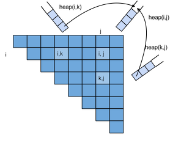

# Cube Pruning Eisner Parser Design Documentation                                                                                     

The cube pruning approach is similar to the methods described in the following paper:                                                    
* Hao Zhang; Ryan McDonald. [Enforcing Structural Diversity in Cube-pruned Dependency Parsing](http://www.aclweb.org/anthology/P/P14/P14-2107.pdf). EMNLP 2014. (this one has the clearest examples of the cube pruning algorithm) 
* Hao Zhang; Ryan McDonald. [Generalized Higher-Order Dependency Parsing with Cube Pruning](http://www.aclweb.org/anthology/D/D12/D12-1030.pdf)                                                                                     
* Hao Zhang; Liang Huang; Kai Zhao; Ryan McDonald. [Online Learning for Inexact Hypergraph Search](http://www.aclweb.org/anthology/D/D13/D13-1093.pdf). [attachment](http://www.aclweb.org/anthology/attachments/D/D13/D13-1093.Attachment.pdf)                                                                                                       

## Design                                                                                                         

The parser will run two arounds. In the first round, normal first order eisner parser will be used to initialize the eisner chart and in the second round, higher feature will be put into account based on higher order feature generator and the weight chart calculated in the first round.                            

### Data Structure
The basic chart element is `EisnerNode(i,j)`, which stores the current score of that cell in the ith row and jth column and the index that divide the cell. The Eisner matrix is a n by n two-dimentional array, each cell 
contains a max-heap in terms of score of the EisnerNode inside of it. 

### Method
 
####`parse(k, arc_weight, sent)` 
Parse the sentence

* `k`: indicate the best-k result will be stored when updating a cell in the chart. if set `k = 1`, higher order  
feature generator will not be envoked.                                                                            
* `arc_weight(feature_vecotr)`: evaluate the edge weight given feature vector
* `sent(head, dep, other, state_info)`:  contains feature generator which will provide feature vector to arc_weight.
the head, dep and other index (sibling or grandchild), state_info pass the current sub tree state information 
to the feature generator in case extra feature will be needed given special dependence pair (features for first
left/right child of a node).

####`find_best_k(heap_ij, heap_ik, heap_kj, k)` 
Find the k-best score from the grid of two sub nodes and update the heap in cell (i,j) 

* `heap_ij`: the target heap to be modified 
* `heap_ik`: the sub node to be combined 
* `heap_kj`: the sub node to be combined  
  
